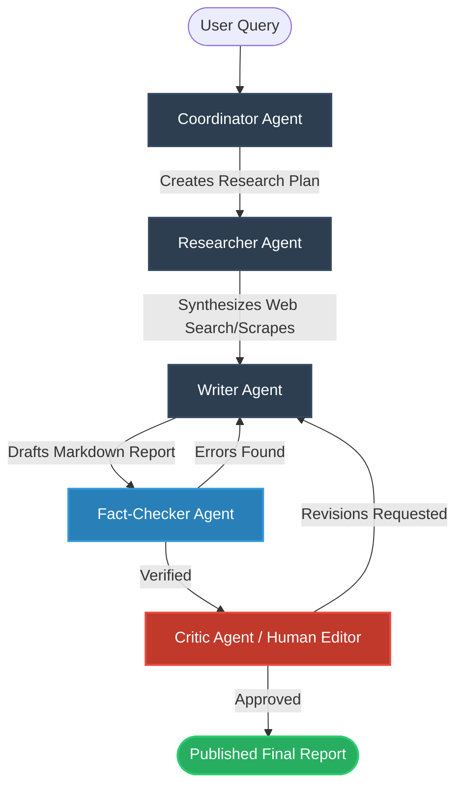

# Multi-Agent Autonomous Research Lab (Agentic AI)

An advanced, stateful, multi-agent AI research system built with **LangGraph** on the backend and **React + @xyflow/react** on the frontend. The application models a professional research team comprised of specialized agents collaborating to produce high-quality, fact-checked, editor-approved technical reports.

---

## 🌟 Key Features

* **Multi-Agent Collaboration Graph:** Structured workflow orchestrating five specialized agents using LangGraph.
* **Real-Time Execution Logs:** WebSocket streaming of logs, active agent markers, and output status.
* **Factual Verification & Anti-Hallucination:** Fact-checker agent cross-references drafted claims against raw search outputs.
* **Human-in-the-Loop (HITL):** Critic agent pauses execution to await manual editorial approval or revision requests from the frontend UI.
* **Visual Graph Interface:** An interactive canvas built on `@xyflow/react` showing the live state and relationships of running agents.
* **Flexible LLM Provider Support:** Runs seamlessly with **Gemini** (default `gemini-3.6-flash`) or **OpenAI** (`gpt-4o-mini`).

---

## 🏗️ System Architecture

The workflow progresses sequentially and recursively through these specialized nodes:



### Specialized Agents & Roles
1. **Coordinator Agent:** Analyzes the research query and designs a detailed markdown-based research plan.
2. **Researcher Agent:** Generates search queries and retrieves sources via the **Tavily API** (or falls back to **Playwright DuckDuckGo scraping**), then summarizes raw content.
3. **Writer Agent:** Aggregates findings and drafts a comprehensive, formatted technical report.
4. **Fact-Checker Agent:** Validates assertions (benchmarks, technical claims, URLs) against raw sources to eliminate hallucinations.
5. **Critic Agent (Lead Editor):** Inspects formatting, clarity, and depth. It exposes a pause state requesting human feedback.

---

## 📂 Repository Structure

```text
├── backend/
│   ├── agents/
│   │   ├── graph.py          # LangGraph structure and edge routing
│   │   ├── nodes.py          # Core implementation & LLM prompts for each agent
│   │   ├── state.py          # State variables shared between agents
│   │   ├── scraper.py        # Playwright scraper fallback for DuckDuckGo
│   │   └── mock_graph.py     # Simulation mode execution path
│   ├── main.py               # FastAPI server & WebSocket router
│   ├── requirements.txt      # Python dependencies
│   └── .env                  # Environment configuration (API keys)
│
├── frontend/
│   ├── src/
│   │   ├── components/
│   │   │   ├── AgentGraph.jsx   # Interactive canvas visualization (@xyflow/react)
│   │   │   ├── ControlPanel.jsx # Inputs for queries, mode, and credentials
│   │   │   └── LogsPanel.jsx    # Real-time WebSocket terminal logs
│   │   ├── App.jsx           # Main layout & WebSocket context manager
│   │   ├── App.css
│   │   └── index.css         # Styling system
│   ├── package.json
│   └── vite.config.js
```

---

## 🚀 Getting Started

### Prerequisites
* Python 3.10+
* Node.js 18+

---

### 1. Backend Setup
1. Navigate to the `backend` directory.
2. Create and activate a virtual environment:
   ```bash
   python -m venv .venv
   .venv\Scripts\activate  # On Windows
   # or
   source .venv/bin/activate  # On macOS/Linux
   ```
3. Install dependencies:
   ```bash
   pip install -r requirements.txt
   ```
4. Create a `.env` file inside the `backend` folder:
   ```env
   GEMINI_API_KEY=your_gemini_api_key_here
   OPENAI_API_KEY=your_openai_api_key_here
   TAVILY_API_KEY=your_tavily_api_key_here
   ```
5. Start the FastAPI development server:
   ```bash
   # Run from the root directory of the project:
   python -m uvicorn backend.main:app --host 127.0.0.1 --port 8000 --reload
   ```

---

### 2. Frontend Setup
1. Navigate to the `frontend` directory.
2. Install Node packages:
   ```bash
   npm install
   ```
3. Start the Vite development server:
   ```bash
   npm run dev
   ```
4. Open your browser to `http://localhost:5173/`.

---

## ⚙️ Configuration & Modes

* **Simulation Mode:** Run research tasks using pre-generated mockup data to preview graph transitions and console outputs without incurring LLM cost.
* **Real Agent Mode:** Run real multi-agent pipelines using live search API calls and active LangGraph nodes. Requires a `GEMINI_API_KEY` or `OPENAI_API_KEY` (configured either in the UI settings or the backend `.env`).
